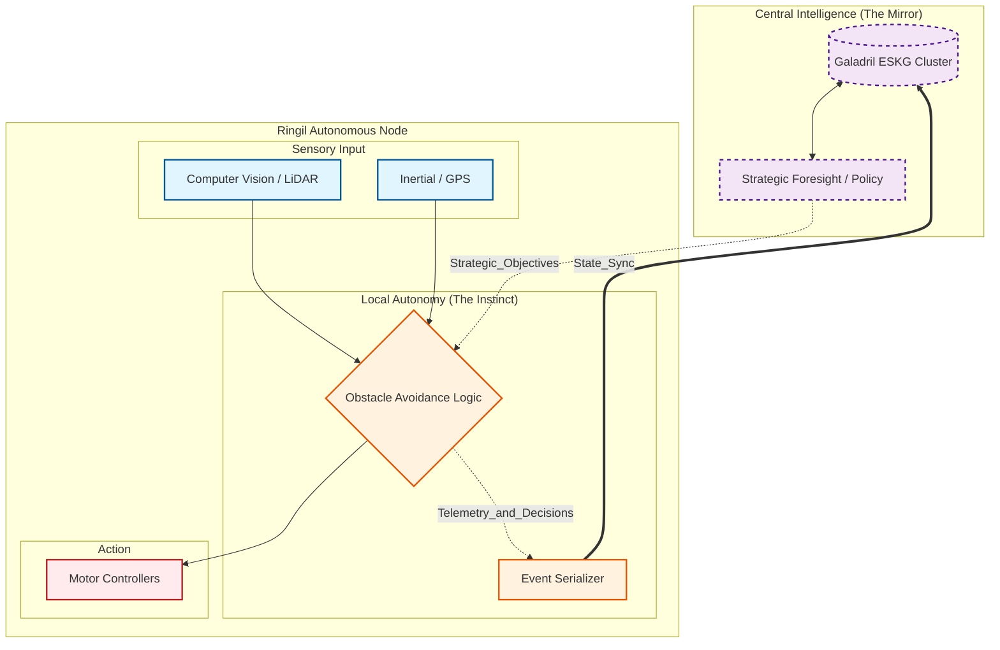

# Ringil 🗡️
 
[GitHub](https://github.com/RealHinome/Ringil)

> *"Yet with his last and desperate stroke Fingolfin hewed the foot with Ringil..."*

**Ringil**  is a system of autonomous swarms for objects--drones, submarines, etc.
Decisions are events recorded and then determined by Galadril, but each entity can independently decide to take action to avoid an obstacle.

> [!CAUTION]
> This project is still in its early stages.

