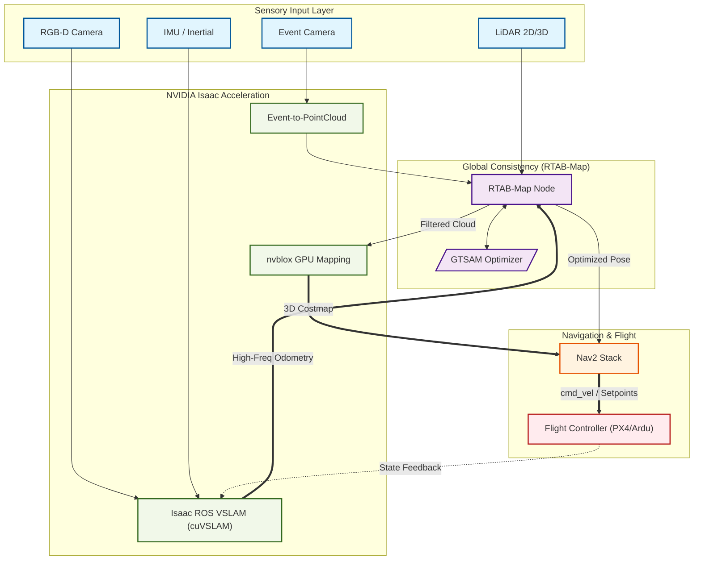

## ROS2 for Ringil 🌊

ROS2 is not the core of Ringil. It is not designed to control everything, but
it handles most of the in-flight autonomy. For more complex tasks, we need to
use custom components. ROS2 is excellent because it brings together a vast
library of academic and industrial research.

| Node | Main Responsibility | Sensor Inputs | Output for the Stack | Why it's used here |
| :--- | :--- | :--- | :--- | :--- |
| **Isaac ROS VSLAM** | Visual-Inertial Odometry (VIO) | Stereo Cameras, IMU | `/visual_odom` | GPU-accelerated (cuVSLAM) for high-frequency, low-latency pose estimation. |
| **RTAB-Map** | SLAM & Sensor Abstraction | LiDAR, PointClouds, VIO | `/rtabmap/mapData`, `/octomap` | Merges heterogeneous sensors into a single 3D map and handles loop closure. |
| **GTSAM** | Pose Graph Optimization | Odom constraints, Loop closures | Optimized Trajectory | Ensures the drone's path is mathematically smoothed and drift-corrected. |
| **nvblox** | 3D Reconstruction | Depth Images, PointClouds | ESDF (Distance Field) | Transforms raw points into a GPU-based distance map for fast obstacle avoidance. |
| **Nav2** | Path Planning & Control | Map, Odom, Costmaps | `cmd_vel` (Velocity) | Calculates global and local paths while avoiding obstacles in real-time. |

